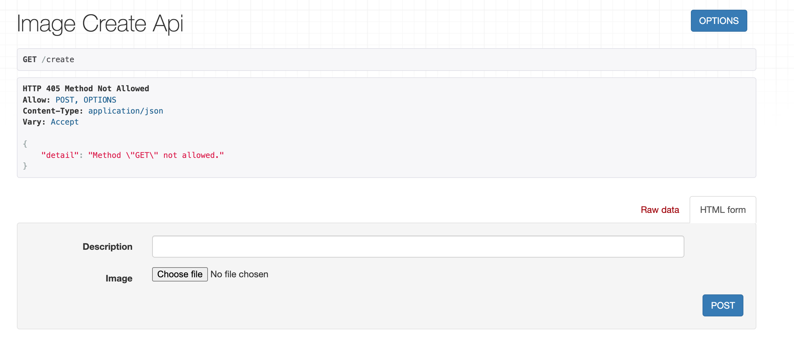
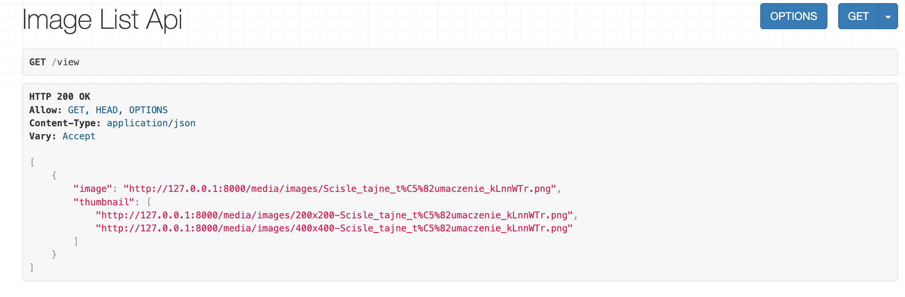
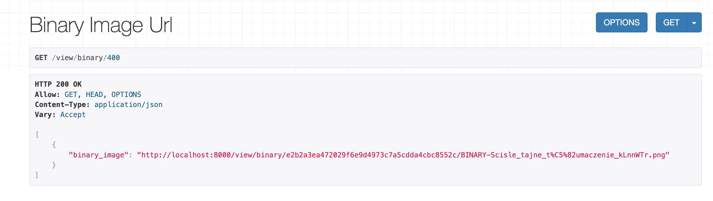

## Backend (Django) Developer - Images

1) The requirements should be installed
  
      `{ pip install requirements.txt }`
  
2) Django can be started with  
      `{ python manage.py runserver }`

## Urls

1) To upload an image the user must be created 
through django-admin panel, when it is done the admin should assign to user an appropriate tier

2) Afterwards, logged in user can upload his images and retrieve them using url requests.

3) Following url is used to request django rest API to upload an image

       `{ localhost:8000/create }`
       

       
4) Using this url user can get uploaded images and functionalities defined in his tier

        `{ localhost:8000/view }`
        

5) To get binary images, following url is used, where integer part is number of seconds after which url will not be available anymore

        `{ localhost:8000/view/binary/400 }`
        

        
## Libraries used

Django-Rest-Framework

vipsthumbnail

## vipsthumbnail

After trying different libraries for creation of thumbnails it appeared that using vipsthumbnail as a 
console command inside python is making the work much quicker than any python libraries. It was an interesting discovery 
and it is a nice thing to use

## Time spent

My first commit was at Jun 12 and the last at Jun 25 when in reality I spent around 4-5 days.